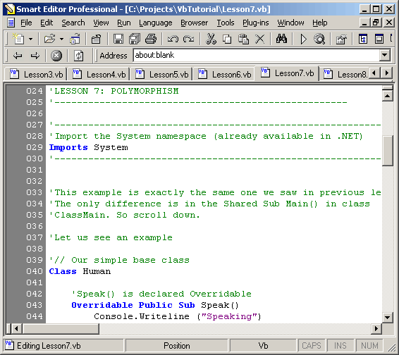



## From VB 6\.0 To VB\.NET \- A Great Tutorial \- For all VB programmers, to upgrade their skills to VB\.NET

### Description

VB.NET is completely Object Oriented. Most VB 6.0 programmers find it difficult to cope up with the new object oriented features of VB.NET. The whole tutorial is divided to 10 lessons. Each lesson is available as a vb source code file, in the same folder. You can open each lesson and start learning. Creating And Using Classes And Objects In VB.NET, Encapsulation, Abstraction, Inheritance And Polymorphism , Overloading And Overriding , Constructors And Destructors ,Static Functions etc - and relevant comparisons with VB 6.0. [Important: This tutorial explains everything from beginning - including how to download and install the free Dotnet Framework. Also, you don't need any other tools - like Visual Studio.NET - to compile the excercises in this tutorial.]
 
### More Info
 

             |
---                |---
**Submitted On**   |2004-05-14 23:49:08
**By**             |[Anoop Madhusudanan](https://github.com/Planet-Source-Code/PSCIndex/blob/master/ByAuthor/anoop-madhusudanan.md)
**Level**          |Intermediate
**User Rating**    |4.7 (107 globes from 23 users)
**Compatibility**  |VB 3\.0, VB 4\.0 \(16\-bit\), VB 4\.0 \(32\-bit\), VB 5\.0, VB 6\.0, VB Script, ASP \(Active Server Pages\) 
**Category**       |[Complete Applications](https://github.com/Planet-Source-Code/PSCIndex/blob/master/ByCategory/complete-applications__1-27.md)
**World**          |[Visual Basic](https://github.com/Planet-Source-Code/PSCIndex/blob/master/ByWorld/visual-basic.md)
**Archive File**   |[From\_VB\_6\_1745435142004\.zip](https://github.com/Planet-Source-Code/anoop-madhusudanan-from-vb-6-0-to-vb-net-a-great-tutorial-for-all-vb-programmers-to-upgrad__1-53789/archive/master.zip)

### Source Code

<table>
 <tr>
 <td vAlign="center" bgcolor="#9999FF"><b>VB.NET
 TUTORIAL</b></td>
 </tr>
 <tr>
 <td vAlign="center">
 
 
<b>Why this tutorial?</b>

 
 
VB.NET is completely Object
 Oriented. Most VB 6.0 programmers find it difficult to cope up with the
 new object oriented features of VB.NET.

 
The whole tutorial is divided to 10
 lessons. Each lesson is available as a vb source code file, in the same
 folder. You can open each lesson and start learning.

 
This tutorial is designed with the
 following objectives.

 <ol>
 <li>To provide a sound knowledge
  about Object Oriented Programming in VB.NET</li>
 <li>To educate how Object Oriented
  techniques are used in VB.NET</li>
 <li>To explain the following
  concepts (tonnes of source code included) simply and easily.
  <ul>
  <li>Creating And Using Classes
  And Objects In VB.NET</li>
  <li>Encapsulation, Abstraction,
  Inheritance And Polymorphism</li>
  <li>Overloading And Overriding</li>
  <li>Constructors And Destructors</li>
  <li>Static Functions</li>
  </ul>
 </li>
 </ol>
 
Go through this tutorial and you
 will start making sense of almost any .NET code. Also, Java/CPP programmers can use
 this to easily learn VB.NET.

 
<b>Compiling
 The Source Code</b>

 
If you already have .NET installed
 in your system, rename the <i>compile.bat.txt</i> file to <i>compile.bat</i>
 and run it. If you are using Smart Editor Professional 2004 as your IDE,
 (from www.logicmatrixonline.com/sepro)
 then open compile.bat and click <i>Run->Execute Batch File</i> 
 After All, <b> VOTE FOR ME IF YOU FIND THIS USEFULL. 
 DOWNLOAD THE ATTACHED FILES, AND START NOW. </b>

 
 

 
 </td>
 </tr>
</table>

